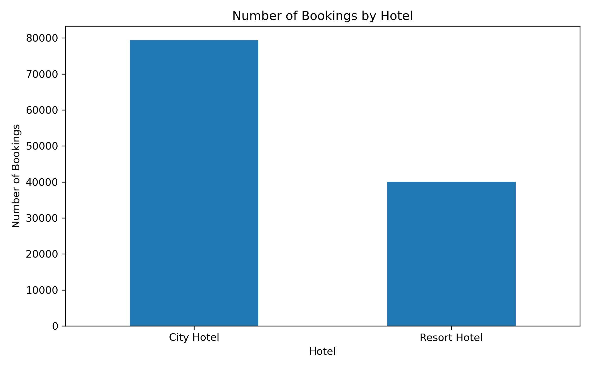
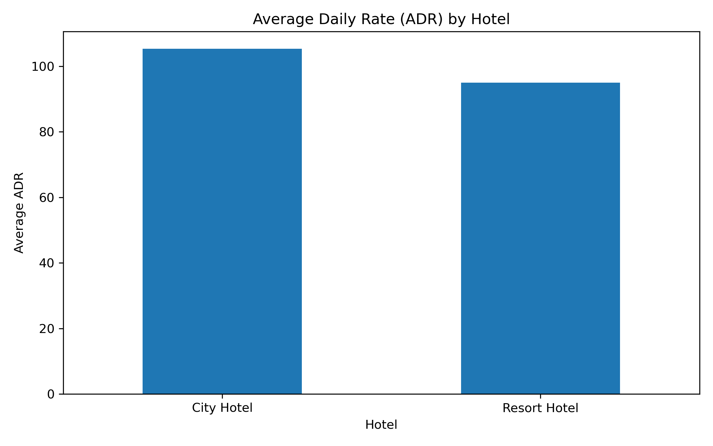
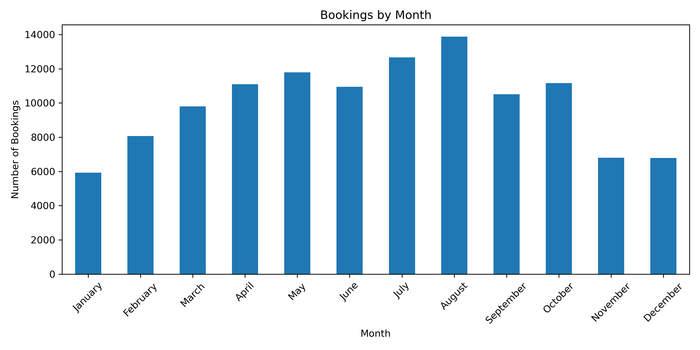
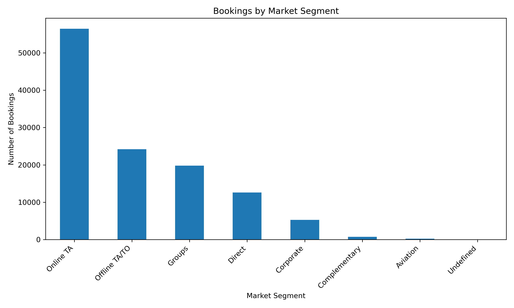

# Hotel Booking Insights

🇧🇷 **Versão em Português**

---

#  Objetivos

- Realizar uma Análise Exploratória de Dados (EDA) utilizando um conjunto de dados de reservas de hotéis.
- Identificar padrões de comportamento dos clientes e das reservas.
- Avaliar indicadores como taxa de cancelamento, ADR (Average Daily Rate) e sazonalidade das reservas.
- Demonstrar a integração entre Python e SQL em um mesmo fluxo analítico.
- Desenvolver um projeto completo para compor um portfólio na área de Análise de Dados.

---

# 📁 Dataset

**Fonte:** Kaggle - Hotel Booking Demand Dataset

**Arquivo original:** `hotel_bookings.csv`

**Banco de dados gerado:** `hotel_bookings.db` (SQLite)

### Principais grupos de variáveis

### Informações da Reserva
- Tipo de hotel
- Status da reserva
- Data de chegada
- Tempo de permanência

### Hóspedes
- Número de adultos
- Número de crianças
- Número de bebês
- País de origem

### Financeiras
- ADR (Average Daily Rate)
- Tipo de depósito
- Tipo de cliente

### Comerciais
- Segmento de mercado
- Canal de distribuição
- Tipo de refeição
- Solicitações especiais

### Variável de Interesse

`is_canceled` → Indica se a reserva foi cancelada.

---

#  Tecnologias Utilizadas

## Linguagens

- Python
- SQL

## Banco de Dados

- SQLite

## Ferramentas

- DB Browser for SQLite
- Visual Studio Code
- Git
- GitHub

## Bibliotecas

- Pandas
- Matplotlib

---

# Workflow do Projeto

## 1. Data Cleaning

- Avaliação da qualidade dos dados.
- Tratamento de valores ausentes.
- Remoção de registros inconsistentes.
- Validação da integridade do dataset.

## 2. Feature Engineering

- Criação da variável `total_nights`.
- Criação da variável `total_guests`.

## 3. Exploratory Data Analysis (EDA)

- Distribuição das reservas por hotel.
- Taxa de cancelamento.
- ADR médio por hotel.
- Distribuição das reservas ao longo dos meses.
- Países com maior número de reservas.
- Segmentação de mercado.

## 4. SQL Analysis

- Criação do banco de dados SQLite.
- Desenvolvimento das consultas SQL.
- Reprodução das principais análises realizadas em Python.
- Validação dos resultados utilizando SQL.

## 5. Data Visualization

- Desenvolvimento dos gráficos em Matplotlib.
- Exportação automática das figuras para a pasta `outputs/figures`.

---

# 📂 Estrutura do Projeto

```text
hotel-booking-insights/

├── data/
│   └── hotel_bookings.csv
│
├── outputs/
│   └── figures/
│       ├── bookings_by_hotel.png
│       ├── adr_by_hotel.png
│       ├── bookings_by_month.png
│       └── market_segments.png
│
├── sql/
│   └── queries.sql
│
├── development_log.md
├── hotel_bookings.db
├── main.py
├── README.md
└── requirements.txt
```

---

#  Principais Análises

## Distribuição das reservas por hotel

O gráfico abaixo apresenta a quantidade de reservas registradas para cada tipo de hotel da base de dados.



---

## ADR médio por hotel

Comparação do Average Daily Rate (ADR) médio entre o City Hotel e o Resort Hotel.



---

## Distribuição das reservas por mês

Visualização da sazonalidade das reservas ao longo do ano, permitindo identificar os períodos de maior e menor demanda.



---

## Distribuição das reservas por segmento de mercado

Comparação entre os principais segmentos responsáveis pelas reservas.



---

#  Principais Insights

- O **City Hotel** concentra aproximadamente o dobro de reservas em relação ao **Resort Hotel**.
- Aproximadamente **37% das reservas foram canceladas**, indicando uma taxa significativa de cancelamentos.
- O **City Hotel** apresentou um **ADR médio superior** ao Resort Hotel.
- **Julho** e **Agosto** representam os meses com maior volume de reservas, evidenciando um comportamento sazonal.
- **Portugal** concentra o maior número de hóspedes da base analisada.
- O segmento **Online TA** representa a maior parte das reservas realizadas.

---

#  Como Executar

## 1. Clone o repositório

```bash
git clone https://github.com/VitoriaBBitencourt/hotel-booking-insights.git
cd hotel-booking-insights
```

## 2. Instale as dependências

```bash
pip install -r requirements.txt
```

## 3. Execute o projeto

```bash
python main.py
```

O script irá:

- realizar o tratamento dos dados;
- executar a análise exploratória;
- gerar o banco SQLite (`hotel_bookings.db`);
- criar automaticamente os gráficos na pasta `outputs/figures`.

## 4. Executar a análise SQL (Opcional)

Abra o banco de dados `hotel_bookings.db` utilizando o **DB Browser for SQLite** e execute as consultas disponíveis em:

```text
sql/queries.sql
```

---

# 👩‍💻 Autora

**Vitória Bitencourt**

GitHub: https://github.com/VitoriaBBitencourt